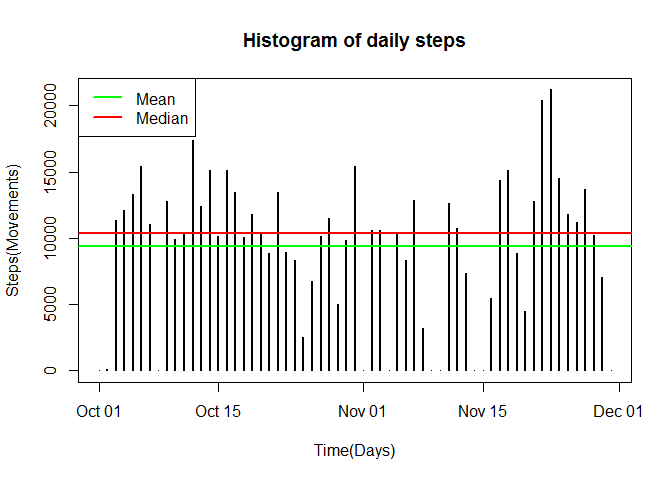
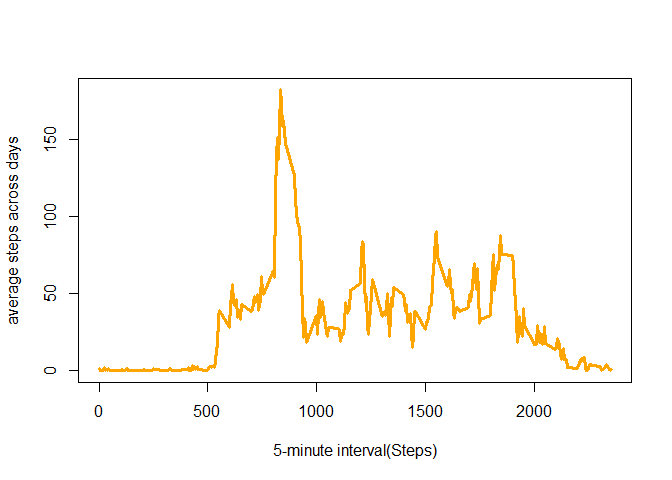
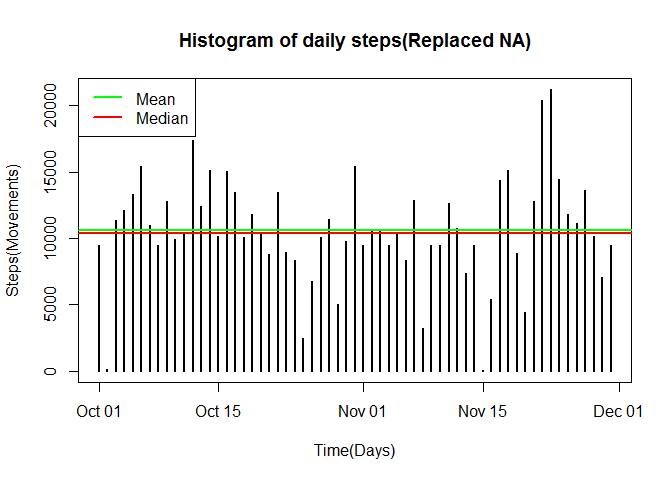
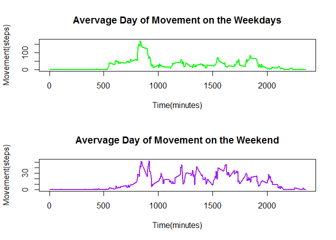

# Movement Study
Akorede Oluwo  
December 19, 2015  


```r
knitr::opts_chunk$set(fig.path='figure/')
```


```r
library(data.table)
```

### Load and preprocessing Data


```r
unzip("Factivity.zip")
dt<-read.csv("activity.csv")
```

### What is mean total number of steps taken per day?

```r
stepsumdt<-tapply(dt$steps, dt$date, sum, na.rm=TRUE)
ddates<-as.Date(names(stepsumdt))
plot(ddates, stepsumdt, type="h",lwd=2, xlab ="Time(Days)", ylab="Steps(Movements)", main="Histogram of daily steps")
abline(h=mean(stepsumdt),col="green",lwd=2)
abline(h=median(stepsumdt),col="red",lwd=2)
legend("topleft",legend=c("Mean","Median"),lwd=c(2,2),col = c("green","red"))
```

 

This is the Mean


```r
mean(stepsumdt)
```

```
## [1] 9354.23
```
This is the median


```r
median(stepsumdt)
```

```
## [1] 10395
```
### What is the average daily pattern

 Make a time series plot (i.e. type = "l") of the 5-minute interval (x-axis) and the average number of steps taken, averaged across all days (y-axis)
 

```r
rangg<-range(as.Date(dt$date))
nnday<-as.numeric(rangg[2]-rangg[1])
avgDay<-tapply(dt$steps, dt$interval, sum, na.rm=TRUE)
averageDay<-avgDay/nnday
plot(names(averageDay),averageDay, type = "l",lwd=3, col="orange", xlab = "5-minute interval(Steps)",ylab = "average steps across days")
```

 

 Which 5-minute interval, on average across all the days in the dataset, contains the maximum number of steps?

```r
names(which(averageDay==max(averageDay)))
```

```
## [1] "835"
```
### Imputing missing values


```r
sum(is.na(dt$steps))
```

```
## [1] 2304
```


```r
fixdt<-dt
for(i in 1:nrow(fixdt)){
        if(is.na(fixdt$steps[i])){
          fixdt$steps[i] <-averageDay[as.character(fixdt$interval[i])]
        }
}

fixstepsumdt<-tapply(fixdt$steps, fixdt$date, sum, na.rm=TRUE)
fixddates<-as.Date(names(fixstepsumdt))
plot(fixddates, fixstepsumdt, type="h",lwd=2, xlab ="Time(Days)", ylab="Steps(Movements)", main="Histogram of daily steps(Replaced NA)")
abline(h=mean(fixstepsumdt),col="green",lwd=2)
abline(h=median(fixstepsumdt),col="red",lwd=2)
legend("topleft",legend=c("Mean","Median"),lwd=c(2,2),col = c("green","red"))
```

 
 The mean in the case of inputed data is a bit apart from the median 

```r
mean(stepsumdt)
```

```
## [1] 9354.23
```


```r
median(stepsumdt)
```

```
## [1] 10395
```
 While in the case of this the mean and the median are close, not so far apart.

```r
mean(fixstepsumdt)
```

```
## [1] 10601.46
```


```r
median(fixstepsumdt)
```

```
## [1] 10395
```
### Are there differences in activity patterns between weekdays and weekends?


```r
weekdt <- fixdt
weekdt$weektype <- as.factor(ifelse(weekdays(as.Date(fixdt$date)) %in% c("Saturday","Sunday"),"weekend", "weekday"))

weekdaydt <- weekdt[which(weekdt$weektype == "weekday"),]
weekenddt <- weekdt[which(weekdt$weektype == "weekend"),]

rngDD <- range(as.Date(weekdaydt$date))
rngEE <- range(as.Date(weekenddt$date))

nDayDD <- as.numeric(rngDD[2] - rngDD[1])
nDayEE <- as.numeric(rngEE[2] - rngEE[1])

sumDayDD <- tapply(weekdaydt$steps, weekdaydt$interval, sum)
sumDayEE <- tapply(weekenddt$steps, weekenddt$interval, sum)

avgDayDD <- sumDayDD / nDayDD
avgDayEE <- sumDayEE / nDayEE

par(mfrow=c(2,1))

plot(names(avgDayDD),avgDayDD, type = "l", lwd = 2, col = "green", main = "Avervage Day of Movement on the Weekdays", xlab = "Time(minutes)", ylab = "Movement(steps)")

plot(names(avgDayEE),avgDayEE, type = "l", lwd = 2, col = "purple", main = "Avervage Day of Movement on the Weekend", xlab = "Time(minutes)", ylab = "Movement(steps)")
```

 
